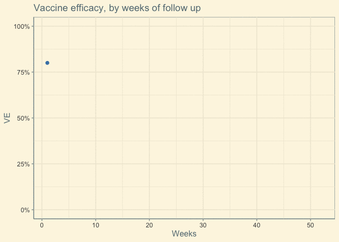
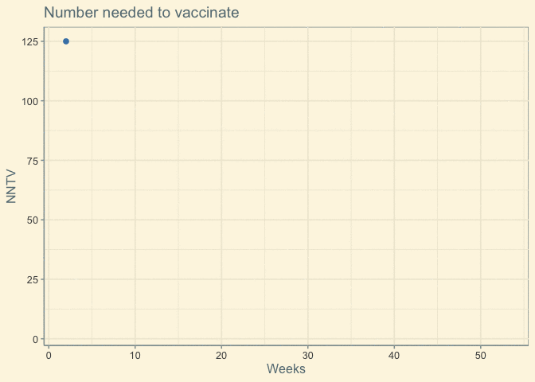

NNTV
================
Lars Mølgaard Saxhaug <https://twitter.com/load_dependent>

Last compiled on Thursday 01 July, 2021

``` r
base_risk <- 0.01
sample_size=1e6
vaccinated_risk <- 0.002
ve_true <- (base_risk-vaccinated_risk)/base_risk
weeks <- 53
df <- tibble(week=1:weeks,vaccinated_healthy=c(sample_size,rep(NA,weeks-1)),placebo_healthy=c(sample_size,rep(NA,weeks-1)))
 for (i in 2:weeks) {
   df[i,"vaccinated_healthy"] <- df[i-1,"vaccinated_healthy"]*(1-vaccinated_risk) 
   df[i,"placebo_healthy"] <-  df[i-1,"placebo_healthy"]*(1-base_risk)
   }

df <- df %>% slice(-1) %>% 
  mutate(eer=(sample_size-vaccinated_healthy)/sample_size,
         cer=(sample_size-placebo_healthy)/sample_size,
         rr=eer/cer,
         ve=1-rr,
         ar=cer-eer,
         nntv=1/ar
         )
```

<!-- -->

<!-- -->
