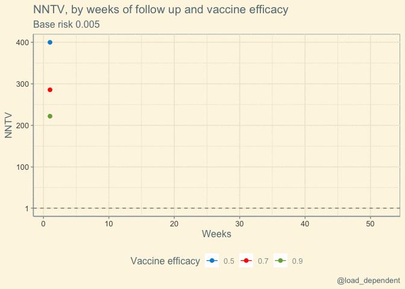

NNTV
================
Lars Mølgaard Saxhaug <https://twitter.com/load_dependent>

Last compiled on Friday 02 July, 2021

``` r
ve_true <- 0.8 # vaccine efficacy, 1-rr
sample_size <- 1e6 # size of each group
weeks <- 52 # maximum number  of weeks of follow up


df <- tibble(
  week = rep(1:weeks, 3),
  base_risk = c(rep(0.01, weeks), rep(0.005, weeks), rep(0.001, weeks)), # base risk per week, three
  vaccinated_risk = base_risk - ve_true * base_risk,
  vaccinated_cases=sample_size-sample_size * (1 - vaccinated_risk)^week,
  placebo_cases=sample_size-sample_size * (1 - base_risk)^week)
d <- df %>% 
  group_by(base_risk) %>% 
nest()

df <- df %>%
  mutate(
    eer = (vaccinated_cases) / sample_size, # exposed event risk
    cer = (placebo_cases) / sample_size, # placebo event risk
    rr = eer / cer,
    ve = 1 - rr,
    ar = cer - eer,
    nntv = 1 / ar
  )
```

#### Variable base risk:

<!-- -->

<!-- --> \#\#\#\# Variable
vaccine efficacy

``` r
rm(ve_true)
sample_size <- 1e6 # size of each group
weeks <- 52 # maximum number  of weeks of follow up
base <- 0.005

df <- tibble(
  week = rep(1:weeks, 3),
  ve_true= c(rep(0.5, weeks), rep(0.7, weeks), rep(0.9, weeks)),
  base_risk = rep(base, 3*weeks), 
  vaccinated_risk = base_risk - ve_true * base_risk,
  vaccinated_cases=sample_size-sample_size * (1 - vaccinated_risk)^week,
  placebo_cases=sample_size-sample_size * (1 - base_risk)^week)


df <- df %>%
  mutate(
    eer = (vaccinated_cases) / sample_size, # exposed event risk
    cer = (placebo_cases) / sample_size, # placebo event risk
    rr = eer / cer,
    ve = 1 - rr,
    ar = cer - eer,
    nntv = 1 / ar
  )
```

<!-- -->

<!-- -->
