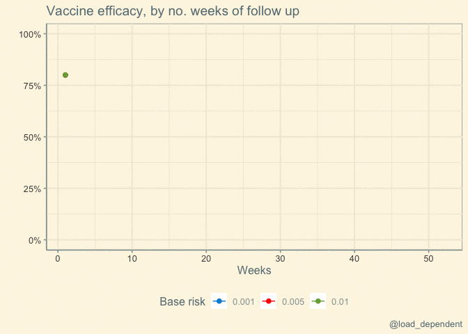
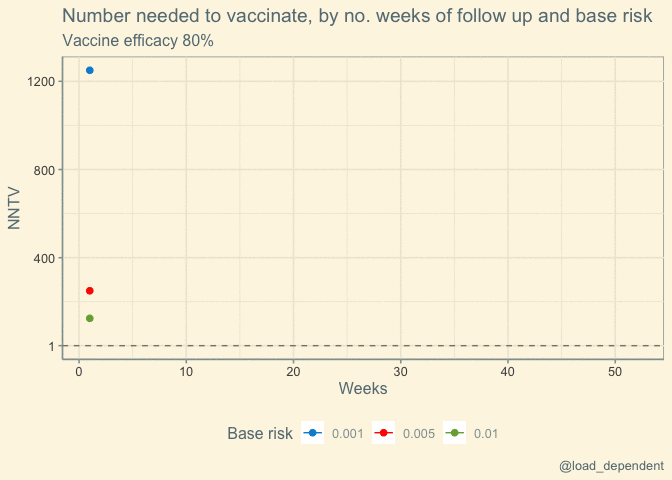

NNTV
================
Lars Mølgaard Saxhaug <https://twitter.com/load_dependent>

Last compiled on Friday 02 July, 2021

``` r
base_risk <- 0.001 # risk per  week placebo group
vaccinated_risk <- 0.0002 # risk per  week vaccinated group
sample_size=1e6 # size of each group
ve_true <- (base_risk-vaccinated_risk)/base_risk
weeks <- 52 # number of weeks

df <- tibble(week=1:weeks,
            vaccinated_cases=sample_size*vaccinated_risk*week,
            placebo_cases=sample_size*base_risk*week)

df <- df  %>% 
  mutate(eer=(vaccinated_cases)/sample_size, # exposed event risk
         cer=(placebo_cases)/sample_size, # placebo event risk
         rr=eer/cer,
         ve=1-rr,
         ar=cer-eer,
         nntv=1/ar
         ) 
```

True vaccine efficacy is 80%
<!-- -->

<!-- -->
